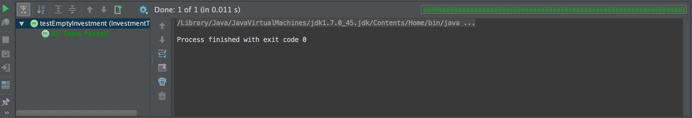
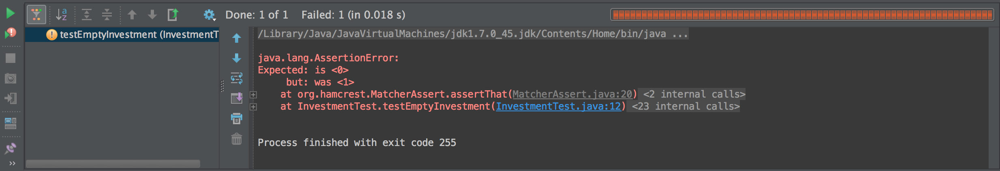
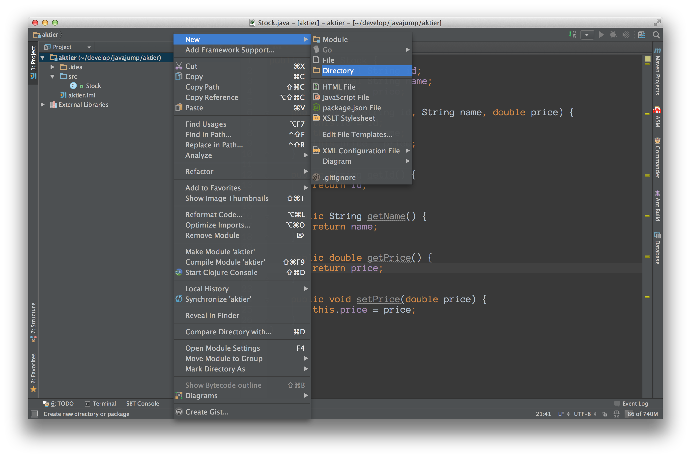
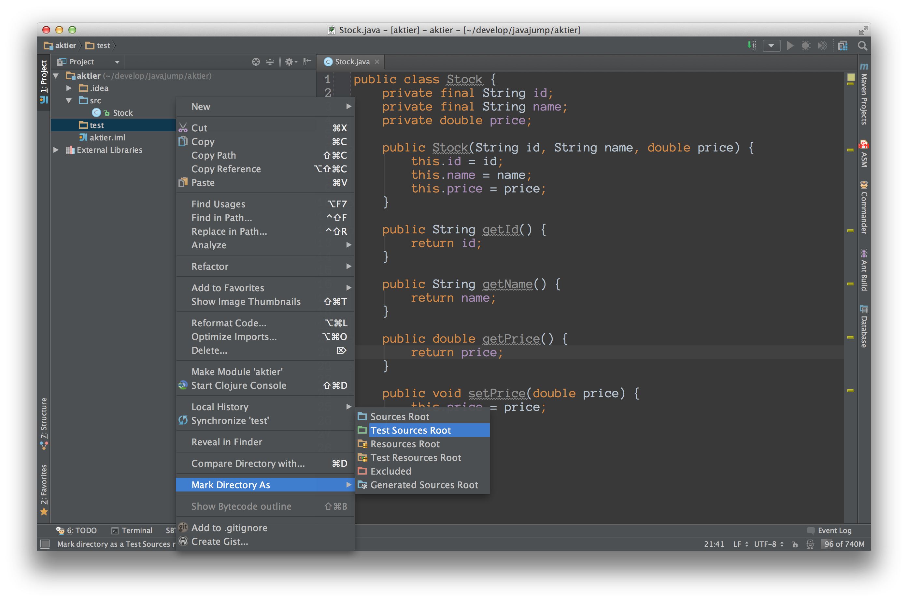
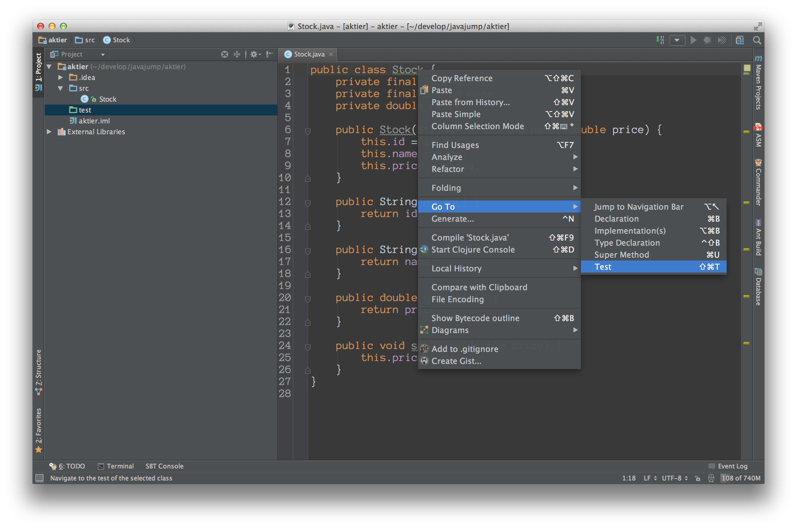
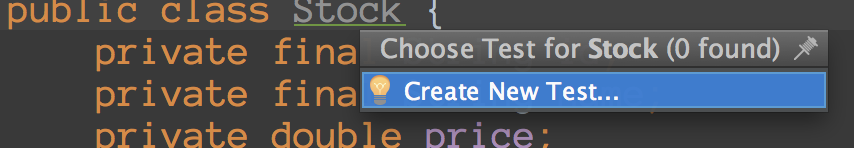
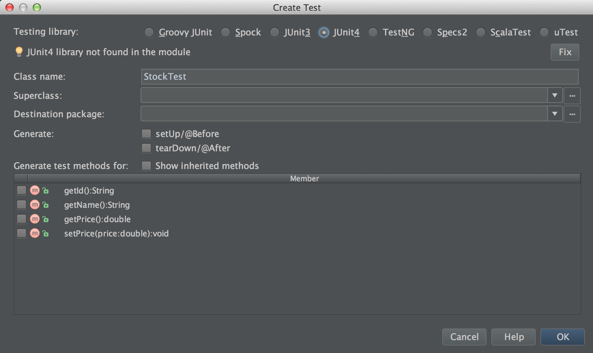

# Enhetstest av innehav

Sedan tidigare har vi en klass för att spåra innehav, samt metoder för att öka och minska innehavet. Nu vill vi ha ett enkelt sätt att verifiera att klassen fungerar som det är tänkt, samt ett sätt att se ifall vidare kodning råkar förstöra funktionalitet.

## Instruktioner

### Skriv ett test

(För hjälp med hur man initierar tester i ett nytt projekt i IntelliJ, se Hjälp nedan)

Enhetstester bör ligga i en egen klass med namn som klassen den testar, med Test på slutet:

	public class InvestmentTest {
		...
	}

Enskilda test skapas som metoder med annotering @Test (skriv @Test före metoden):

	public class InvestmentTest {
		
		@Test
		public void testEmptyInvestmentContainsNoStocks() {
				Stock stock = new Stock("ERIC B", "Ericsson B", 80.0);
				Investment investment = new Investment(stock);
		
				assertThat(investment.getAmount(), is(0));
		}
	}

1. Namnge testmetoden så den beskriver vad som testas. I det fallet ovanför testar vi att en nyskapad Investment inte innehåller några aktier.

2. Skapa vårt testobjekt - i det här fallet måste vi även skapa en aktie att ha i innehavet:
	Stock stock = new Stock("ERIC B", "Ericsson B", 80.0);  		
	Investment investment = new Investment(stock);

3. Verifiera utfallet med assert-metoder. Tydligast är assertThat, vilken är menad att läsas på engelska: **assert that investment.getAmount() is _(returnerar i det här fallet)_ 0**; det vill säga att antalet aktier är 0 från början.

### Kör testet

Testklassen (InvestmentTest i det här fallet) går att köra direkt från IntelliJ precis som en vanlig körbar klass med main-metod: ctrl-shift-f10 på klassnamnet. Om markören står i en metod istället, så körs enbart den testmetoden.

Om allt gick bra visar IntelliJ grönt: 

Om det å andra sidan blev något fel visar IntelliJ rött och även vad som gick fel: 
Här kan vi se att på InvestmentTest rad 12 förväntades 0 men fick 1, klicka på filnamnet i feltexten för att se det test som gick fel

### Skriv flera test

När antalet test på samma klass växer kommer vi troligen ha samma kod för att skapa testobjekt på flera ställen. Eliminera den duplicerade koden genom att flytta ut den till ett block som körs innan varje test:

	public class InvestmentTest {

    Stock stock; 
    Investment investment; 
    
    @Before
    public void before() {
        stock = new Stock("ERIC B", "Ericsson B", 80.0);
        investment = new Investment(stock);
    }

@Before är annoteringen som talar om för JUnit att denna metod ska köras innan varje test

## Uppdraget

Skriv testfall som testar alla aspekter av ett innehav:
* att köpa aktier (vad händer med antal, vad händer med värde, vad händer med inköpspris)
* att sälja aktier (vad händer med antal, vad händer med värde, vad händer med inköpspris)
* vad händer om man försöker sälja fler aktier än man har
* vad händer med värdet om aktiens pris ändras

## Hjälp

### Förbered projektet för enhetstestning (i IntelliJ)

1. Högerklicka på projektet och välj New -> Directory 

2. Namnge nya mappen "test" eller "tests" eller vad ni tycker passar (test är standard)

3. Högerklicka på den nya mappen och välja Mark Directory As -> Test Sources Root 

### Skapa ett nytt test

1. Högerklicka på klassnamnet **i editorfönstret** och välj Go To -> Test 

2. Välj "Create new test" 

3. Välj JUnit4 under "Testing library". Ni får en varning att den inte hittar JUnit4 i modulen. Klicka på "Fix" längst till höger. 

4. Klicka OK

